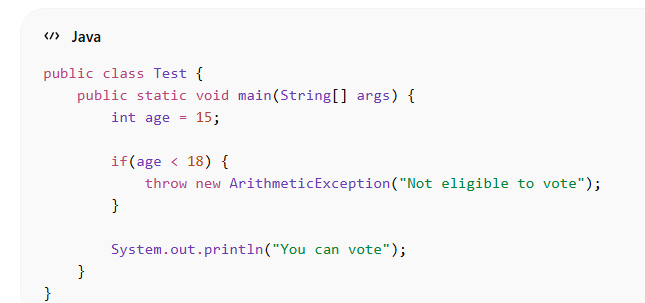

1. throw (keyword)

👉 Used inside the method
👉 Used to actually throw an exception

✔ Meaning in simple words

You are manually creating and throwing an error

✅ 2. throws (keyword)

👉 Used in method declaration
👉 Used to tell the compiler that this method may cause an exception

import java.io.*;

class Test {
    static void readFile() throws IOException {
        FileReader f = new FileReader("abc.txt");
    }

    public static void main(String[] args) throws IOException {
        readFile();
    }
}

✅ 3. Throwable (class)

👉 This is a parent class of all exceptions and errors

✔ Meaning in simple words

It is the root class from which all exceptions come.

Hierarchy:

Throwable
   ├── Exception
   └── Error

   class Test {
    public static void main(String[] args) {
        Throwable t = new ArithmeticException("Error occurred");
        System.out.println(t);
    }
}

✔ Here we used Throwable as a reference type