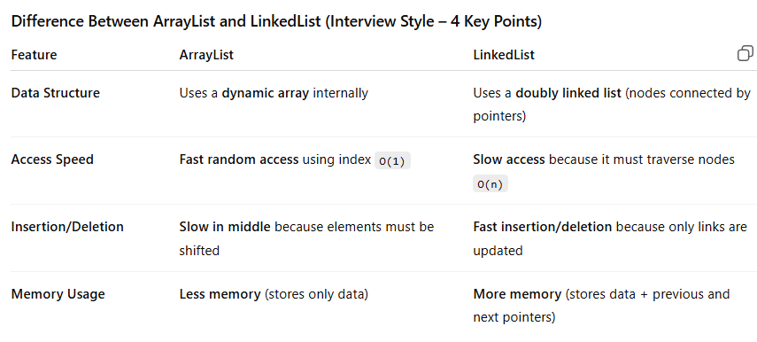
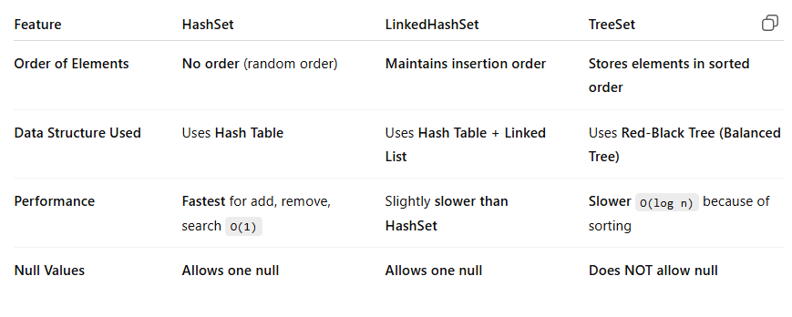

ArrayList is better for fast access and reading data, while LinkedList is better for frequent insertions and deletions.

HashSet → fastest but no order, LinkedHashSet → keeps insertion order, TreeSet → keeps elements automatically sorted.

Collision Resolution is a technique used in hashing to handle the situation when two or more keys map to the same hash index in a hash table.

1. Separate Chaining

In this method, each hash table index stores a linked list (chain).

If multiple keys map to the same index, they are stored in that list.

Example:
Index 5 → 15 → 25 → 35

Key idea: Colliding elements are stored in a linked list at the same index.

2. Open Addressing

In this method, all elements are stored inside the hash table itself.

If a collision occurs, the algorithm searches for another empty slot using a probing technique.

Three types of probing:

Linear Probing

Check the next slot sequentially.

Formula: index + 1, index + 2 ...

Quadratic Probing

Check positions using square increments.

Formula: index + 1², index + 2² ...

Double Hashing

Uses a second hash function to find the next position.